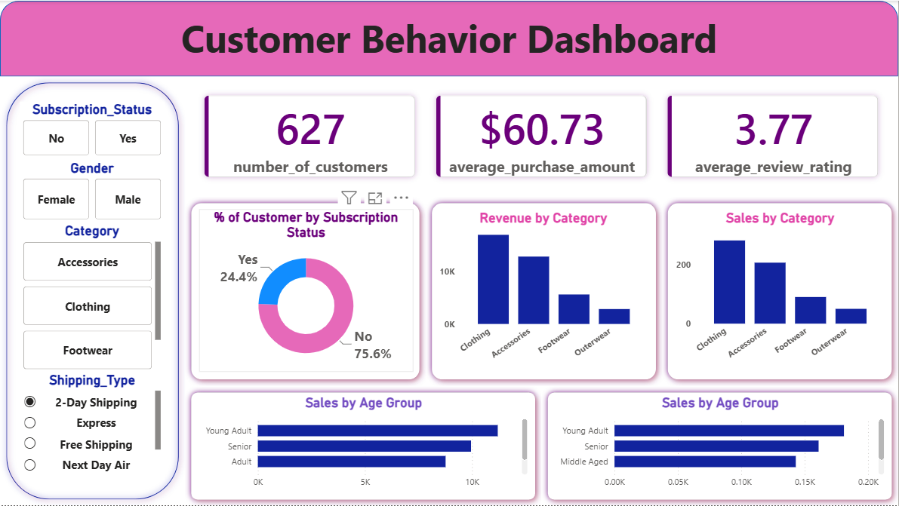

# 🛍️ Customer Shopping Behavior Analysis

A full-stack data analytics project analyzing 3,900 customer transactions to uncover
shopping patterns, customer segments, and revenue drivers using Python, SQL, and Power BI.

---

## 📌 Business Problem

A retail company wants to understand customer shopping behavior to improve sales,
satisfaction, and loyalty. The key question:

> *"How can the company leverage consumer shopping data to identify trends, improve
> customer engagement, and optimize marketing and product strategies?"*

---

## 🔧 Tools & Technologies

| Layer         | Tool                          |
|---------------|-------------------------------|
| Data Cleaning | Python (Pandas)               |
| Database      | PostgreSQL                    |
| Visualization | Power BI (DAX, Power Query)   |
| IDE           | VS Code, pgAdmin              |
| Version Control | Git & GitHub               |

## 📊 Dataset Summary

- **Rows:** 3,900 transactions
- **Columns:** 18 features
- **Key Features:**
  - Customer demographics: Age, Gender, Location, Subscription Status
  - Purchase details: Item, Category, Amount, Season, Size, Color
  - Behavior signals: Discount Applied, Previous Purchases, Frequency, Review Rating, Shipping Type
- **Missing Data:** 37 null values in `Review Rating` → imputed using category-level median

## 🐍 Python — Data Preparation ([customer_behavior.ipynb](customer_behavior.ipynb))

- Loaded and explored dataset with `pandas` (`df.info()`, `df.describe()`)
- Handled missing values in `review_rating` using **category-level median imputation**
- Renamed columns to **snake_case** for consistency
- **Feature Engineering:**
  - `age_group` — binned customer ages into segments
  - `purchase_frequency_days` — derived from purchase frequency data
- Dropped redundant `promo_code_used` column (duplicate of `discount_applied`)
- Exported cleaned data to **PostgreSQL** for SQL analysis


## 🗄️ SQL — Business Queries ([`customer_behavior_queries.sql`](customer_behavior_queries.sql))

Ten business questions answered in PostgreSQL:

---

### Q1. Revenue by Gender
```sql
SELECT gender, SUM(purchase_amount) AS revenue
FROM customer_behavior
GROUP BY gender;
```
> 💡 **Finding:** Male customers generated $157,890 vs Female $75,191

---

### Q2. High-Spending Discount Users
```sql
SELECT customer_id, purchase_amount
FROM customer_behavior
WHERE discount_applied = 'Yes' 
AND purchase_amount >= (SELECT AVG(purchase_amount) FROM customer_behavior);
```
> 💡 **Finding:** 839 customers spent above average even with discounts

---

### Q3. Top 5 Products by Review Rating
```sql
SELECT item_purchased,
       ROUND(AVG(review_rating::numeric), 2) AS average_product_rating
FROM customer_behavior
GROUP BY item_purchased
ORDER BY AVG(review_rating) DESC
LIMIT 5;
```
> 💡 **Finding:** Gloves (3.86), Sandals (3.84), Boots (3.82) are top rated

---

### Q4. Shipping Type Comparison
```sql
SELECT shipping_type,
       ROUND(AVG(purchase_amount), 2) AS average_shipping_type_cost
FROM customer_behavior
WHERE shipping_type IN ('Standard', 'Express')
GROUP BY shipping_type;
```
> 💡 **Finding:** Express ($60.48) users spend slightly more than Standard ($58.46)

---

### Q5. Subscribers vs Non-Subscribers
```sql
SELECT subscription_status,
       COUNT(customer_id) AS total_customers,
       ROUND(AVG(purchase_amount), 2) AS avg_spend,
       ROUND(SUM(purchase_amount), 2) AS total_revenue
FROM customer_behavior
GROUP BY subscription_status
ORDER BY total_revenue, avg_spend DESC;
```
> 💡 **Finding:** Non-subscribers generate more total revenue ($170,436) due to higher count

---

### Q6. Discount-Dependent Products
```sql
SELECT item_purchased,
       ROUND(100.0 * SUM(CASE WHEN discount_applied = 'Yes' THEN 1 ELSE 0 END) / COUNT(*), 2) AS discount_rate
FROM customer_behavior
GROUP BY item_purchased
ORDER BY discount_rate DESC
LIMIT 5;
```
> 💡 **Finding:** Hat (50%), Sneakers (49.66%), Coat (49.07%) are most discount-dependent

---

### Q7. Customer Segmentation
```sql
WITH customer_type AS (
    SELECT customer_id, previous_purchases,
           CASE
               WHEN previous_purchases = 1 THEN 'New'
               WHEN previous_purchases BETWEEN 2 AND 10 THEN 'Returning'
               ELSE 'Loyal'
           END AS customer_segment
    FROM customer_behavior
)
SELECT customer_segment, COUNT(*) AS number_of_customers
FROM customer_type
GROUP BY customer_segment;
```
> 💡 **Finding:** Loyal: 3,116 | Returning: 701 | New: 83

---

### Q8. Top 3 Products per Category
```sql
WITH item_counts AS (
    SELECT category, item_purchased,
           COUNT(customer_id) AS total_orders,
           ROW_NUMBER() OVER (PARTITION BY category ORDER BY COUNT(customer_id) DESC) AS item_rank
    FROM customer_behavior
    GROUP BY category, item_purchased
)
SELECT item_rank, category, item_purchased, total_orders
FROM item_counts
WHERE item_rank <= 3;
```
> 💡 **Finding:** Jewelry, Blouse, Sandals, Jacket lead their respective categories

---

### Q9. Repeat Buyers & Subscriptions
```sql
SELECT subscription_status, COUNT(customer_id) AS repeated_buyers
FROM customer_behavior
WHERE previous_purchases > 5
GROUP BY subscription_status;
```
> 💡 **Finding:** 2,518 repeat buyers are non-subscribers — a key conversion opportunity

---

### Q10. Revenue by Age Group
```sql
SELECT age_group, SUM(purchase_amount) AS total_revenue
FROM customer_behavior
GROUP BY age_group
ORDER BY total_revenue DESC;
```
> 💡 **Finding:** Young Adults lead with $62,143, followed by Middle-aged ($59,197)

---

## 📈 Power BI Dashboard ([`customer_behavior_dashboard.pbix`](customer_behavior_dashboard.pbix))

> ⚠️ `.pbix` files require **Power BI Desktop** to open.
> Download the file or view the screenshot below.

### 📊 Dashboard Preview


### 🎛️ Dashboard Features
- **KPI Cards:**
  - 👥 3.9K Total Customers
  - 💰 $59.76 Average Purchase Amount
  - ⭐ 3.75 Average Review Rating

- **Slicers/Filters:**
  - Subscription Status (Yes / No)
  - Gender (Male / Female)
  - Category (Accessories, Clothing, Footwear, Outerwear)
  - Shipping Type

- **Visuals:**
  - 🍩 Subscription Status Donut Chart (Yes 27% / No 73%)
  - 📊 Revenue by Category (Bar Chart)
  - 📊 Sales by Category (Bar Chart)
  - 📊 Revenue by Age Group (Horizontal Bar)
  - 📊 Sales by Age Group (Horizontal Bar)

  ## 💡 Business Recommendations

1. **Boost Subscriptions** — Only 27% are subscribers; promote exclusive perks to convert loyal buyers
2. **Loyalty Programs** — Reward the 3,116 loyal customers to retain and upsell
3. **Review Discount Policy** — ~50% discount rate on some products risks margin erosion
4. **Product Positioning** — Highlight top-rated items (Gloves, Sandals, Boots) in campaigns
5. **Targeted Marketing** — Focus on Young Adults and Express Shipping users (highest spenders)

## 📬 Contact

**Vickey Kumar**
[](https://linkedin.com/in/vickey-kumar-439494242)
[](https://github.com/vickey1505)

